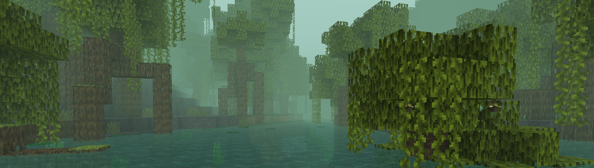

# Fogger Mod
 

Fogpacks! Create Fogpack files with customization patterns for the Minecraft world.

A fork (and rewritten) of the original [1024-byteeeee's Kaleidoscope](https://github.com/1024-byteeeee/Kaleidoscope).

## Instalation
1. Download and install the Fabric Mod Loader
  - [Fabric](https://fabricmc.net/use/installer/) and [Fabric API](https://www.curseforge.com/minecraft/mc-mods/fabric-api)
2. Download the mod on official links and drop into your mods folder
  - [Modrinth](https://modrinth.com/mod/some-more-blocks)



## Fogpack Configuration
Fog Packs can be created using a simple JSON file that must be imported into the Fogpacks folder located in `./minecraft/fogpacks/`.

Only files named `*.fogpack.json` will be recognized by the mod.

````jsonc
{
  "$schema": "https://www.sefacestudios.net/fogpack.schema.v1.json", // Useful for more elaborate text editors.
  "version": "1.0.0", // The Fogpack version.
  "name": "My new Fogpack", // The Fogpack name.
  "identifier": "notch:something_that_i_did", // The Fogpack identifier. This identifier must be unique and in the format 'namespace:identifier'.
  "description": "In the past this was something. Or...", // The Fogpack description.
  "authors": ["Seface Studios", "notch"], // Everyone involved in setting up this Fogpack.

  "config": {
    "sky": {
      "color": "#FFFFFF" // Hexadecimal value of the color to be applied for the sky.
    },

    "fog": {
      "color": "#FFFFFF" // Hexadecimal value of the color to be applied for the fog.
      "distance": 16 // The distance (in chunks) the fog will be in relation to the player. Default: -1 (relative to Render Distance)
      "start_multiplier": 20 // The multipler (0-100) for the start distance in relation to the player. Default: 20
    },
    
    "water": {
      "color": "#FFFFFF" // Hexadecimal value of the color to be applied for the water.
    },
    
    "water_fog": {
      "color": "#FFFFFF" // Hexadecimal value of the color to be applied for the water fog.
    }
  }
}
````

## Fogger Commands

- **/fogger use \<identifier>** - Applies a specific Fogpack.
  - identifier: The Fogpack identifier. Example: minecraft:vanilla

- **/fogger generate \<identifier> \<name>** - Generates a new *.fogpack.json on fogpacks folder.
  - identifier: The Fogpack identifier. Example: notch:custom_fogpack 
  - name: The Fogpack name. Example: My beautiful Fogpack.

- **/fogger info** - Returns all values of the Fogpack that are applied.

- **/fogger reload** - Reload every Fogpack file and import new ones.

- **/fogger reset** - A alias for `/fogger use minecraft:vanilla` command.

> [!NOTE]
> Have you found any bug or inconsistency in the new blocks? Please open an [issue](https://github.com/Seface-Blocks/more-blocks-mod/issues) for us to review and correct in future versions.

---
<div>
  

<h3>Seface Studios</h3>
  <p><a href="mailto:contact@sefacestudios.net">contact@sefacestudios.net</a> · <a title="X/Twitter" href="https://x.com/SefaceStudios">@SefaceStudios</a></p>
</div>